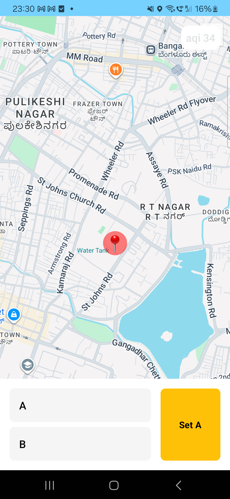
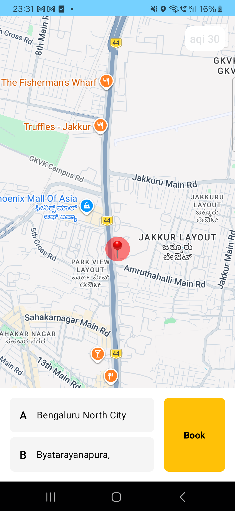
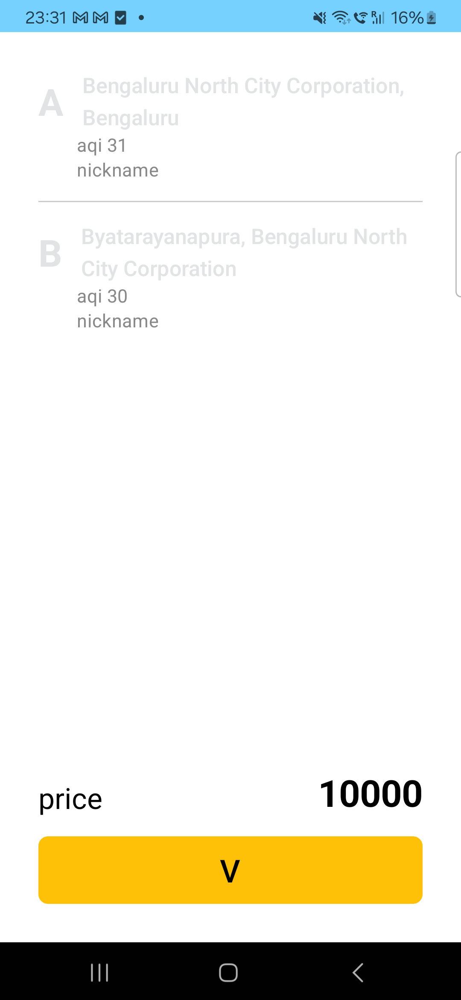
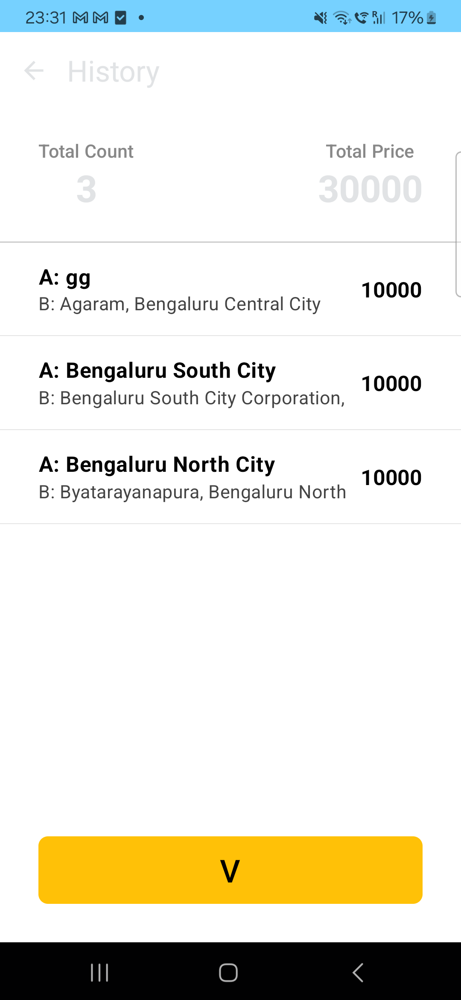

# MVL Trip Booking App

A high-quality Android application for booking trips with real-time Air Quality Index (AQI) tracking and Google Maps integration.

## 📱 Screenshots

<p align="center">
  
  
  
  
</p>

## 🚀 Architecture & Tech Stack
This project follows **Modern Android Development (MAD)** practices and **Clean Architecture** principles:

- **Presentation Layer**: Jetpack Compose for a fully declarative UI.
- **Domain Layer**: Implementation of UseCases for business logic (e.g., `GetFormattedAddressUseCase`).
- **Data Layer**: Repository pattern for managing data from multiple sources (Google Maps, Google Air Quality API, and Mock API).
- **State Management**: MVVM with Kotlin Flow and Coroutines for asynchronous handling.
- **Dependency Injection**: Hilt for clean and testable code.
- **Networking**: Retrofit for API communication.

## 🛠 Features
1. **Interactive Map**: Select Point A and Point B by dragging the map.
2. **Real-time AQI**: Fetches live Air Quality data using Google's Air Quality API.
3. **Smart Geocoding**: Automatically cleans up address results to prioritize recognizable locality names.
4. **Booking Flow**: Smooth transition from selection to nickname entry, price calculation, and summary.
5. **Trip History**: View a summary of total bookings and total price with a detailed history list.

## 🔑 Setup Instructions
To run this project, you need to provide your own **Google Maps API Key**:

1. Open `local.properties` in the root directory.
2. Add the following line:
   ```properties
   MAPS_API_KEY=YOUR_API_KEY_HERE
   ```
3. The `build.gradle.kts` is configured to automatically inject this key into the app's `BuildConfig`.

## 🧪 Security & Quality
- **No Hardcoded Keys**: API keys are managed through `local.properties` and `BuildConfig`.
- **Error Handling**: API calls are wrapped in try-catch blocks with graceful fallbacks.
- **Performance**: Map-move triggers are debounced to prevent excessive API calls.
- **UX**: Follows standard Android navigation patterns with proper backstack management.

---
Built for the MVL Android Developer Assignment.
